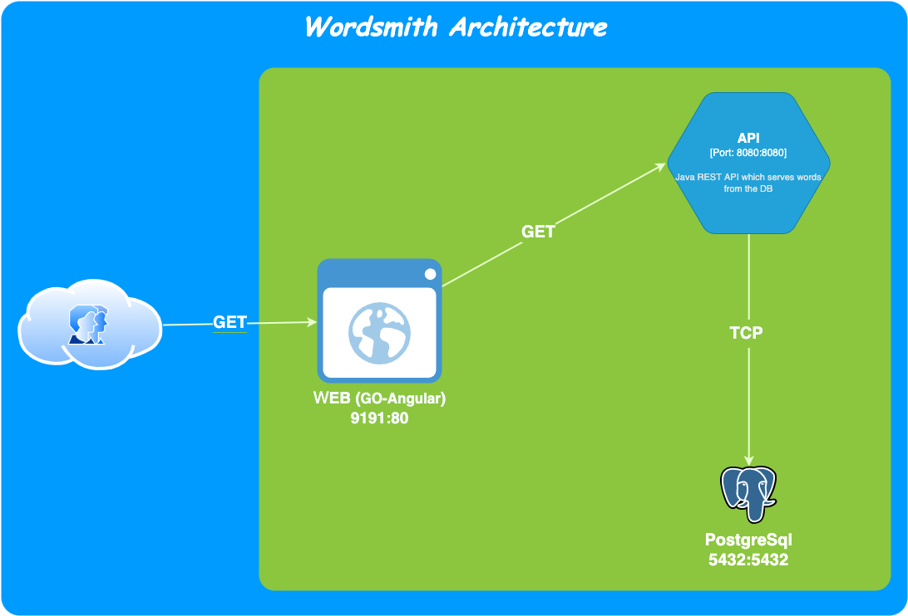

# Docker Compose & Kubernetes Workshop

In this workshop, we will work with the **Wordsmith** application which is the demo project shown at DockerCon EU 2017 and 2018.

**NB:** Please try to find your own solutions before getting response from the repository.

## Architecture Schema



***

## Preamble

We have 3 containers to manage for Wordsmith App.

- **db** : is a Postgresql database which stores words like Nouns, Adjectives and Verbs.


- **api** : is a Java REST API which serves words read from the database and expose them through specific endpoints.


- **web** : is a Go web application which calls the **api** and builds words into sentences

***

## Instructions

1. Clone the project in your local machine.

```shell
git clone git@github.com:codeworks-secops/docker-compose-k8s-workshop.git
```

2. Checkout the `code-base` branch to start.

```shell
git checkout code-base
```

3. Dockerize the api and db modules

***

### Step 1 : Use Docker Compose to containerise Wordsmith App

1. Create a new directory named `.dck8s` in the root of your local project


2. Create a new directory named `compose` inside `.dck8s` directory.


3. Create a new manifest file named `docker-compose.yml` inside `.dck8s/compose` directory.


4. Create 3 new services according to the architecture schema :
   
   - db : service to manage Postgresql database docker resources
   - api : service to manage API docker resources
   - web : service to manage WEB docker resources

**NB:** you must use your Dockerfile manifests to build your services (think build context)

5. Play with all commands offered by Docker Compose, like : build, images, ls, up, down, start, stop, logs,...


6. Test your Docker Compose manifest file.


7. Could you see your App deployed ?


8. If you prefer, push your 3 images to the Docker Hub using your personal docker hub access.

***

### Step 2 : Use Kubernetes Manifest Deployment Yml (Part 1)
    
1. Create a new directory named `k8s` inside `.dck8S` directory.


2. Create 3 new directories named respectively `api`, `db` and `web` inside `k8s` directory.


3. On each directory : 

   - Create a new manifest service by project.
   
   - Create a new manifest deployment by project.
   

4. **Tips** : use Secret workload to manage sensitive data like postgres user password and database name. 


5. Try to respect exposed ports according to the architecture schema.


6. Test all your workloads.


7. Could you access your application ?


8. Could you access your databases from anywhere ?

***

### Step 3 : Use Kubernetes Manifest StatefulSet Yml (Part 2)

Change deployment manifest to statefulSet for db project to have persistence status for your Postgres database

***

## Solutions

Docker Compose : [click here](https://github.com/codeworks-secops/docker-compose-k8s-workshop/tree/docker-compose-deployment)

Kubernetes Manifest Deployment : [click here](https://github.com/codeworks-secops/docker-compose-k8s-workshop/tree/k8s-deployment)

Kubernetes Manifest StatefulSet : [click here](https://github.com/codeworks-secops/docker-compose-k8s-workshop/tree/k8s-statefulset)
